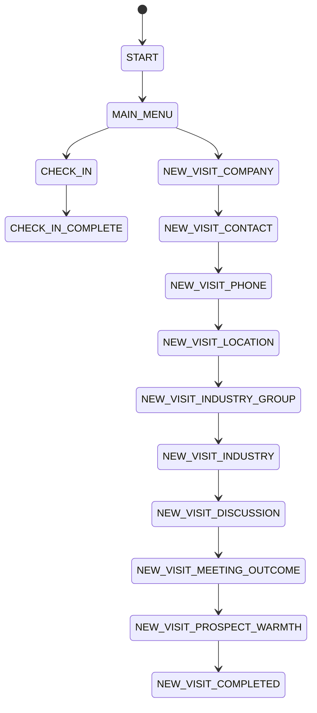

# JAIDAR WhatsApp Sales Field Agent Bot

This project is a production-oriented WhatsApp sales bot scaffold for field agents. It follows a conversation-state architecture, uses Twilio-compatible outbound content patterns, and keeps the business logic independent from Twilio-specific inbound payload field names.

## Current architecture

A. Current architecture
- Existing implementation already had a minimal in-memory conversation flow and a Twilio webhook.
- The project used direct `Twilio` API calls and a simple `Map`-based conversations store.

B. Problems/gaps
- In-memory state was not durable across restarts.
- No clean state machine or action abstraction existed.
- Location token security was not implemented.
- No webhook validation, idempotency, or duplicate handling.
- No real request/response separation between transport and domain logic.

C. Target architecture
- Twilio adapter -> IncomingAction -> conversation state machine -> domain services -> in-memory repositories.
- The app can later be swapped to PostgreSQL with minimal changes because the repository boundary is isolated.

D. Database schema
- The project intentionally uses an in-memory repository instead of a real PostgreSQL instance for local execution, as requested.
- The normalized conceptual schema is:
  - agents
  - conversations
  - conversation_events
  - processed_inbound_messages
  - check_ins
  - customer_visits
  - customers
  - customer_contacts
  - follow_ups
  - location_tokens
  - audit_logs

E. Conversation state machine


F. Implementation plan
1. Keep the existing Twilio webhook entry point and route structure.
2. Move the logic into a dedicated state machine and action parser.
3. Add secure location tokens and a browser geolocation page.
4. Add duplicate-message protection and audit logging.
5. Validate the key flows with tests.

## Local development

1. Copy `.env.example` to `.env`.
2. Install dependencies:
   ```bash
   npm install
   ```
3. Start the app:
   ```bash
   npm run dev
   ```
4. Test:
   ```bash
   npm test
   ```

## Twilio setup
- Validate the `TWILIO_ACCOUNT_SID`, `TWILIO_AUTH_TOKEN`, and `TWILIO_WHATSAPP_NUMBER` values.
- Configure the WhatsApp Sandbox or production number in Twilio.
- Point the webhook to `https://<your-domain>/webhooks/whatsapp`.

## S3 and location capture setup
- Set `WHATSAPP_LOCATION_IMAGE_URL` to a public asset URL.
- Use a secure frontend page at `/geo/capture` to request browser geolocation.
- Tokens are generated with `crypto.randomBytes` and expire automatically after `LOCATION_TOKEN_TTL_SECONDS`.

## Security notes
- Webhook validation is enabled in production mode.
- Location tokens are single-use and time-limited.
- No secrets are stored in source control.
- Only placeholder/mock persistence is used in this local repo rather than a real PostgreSQL database because the requirement explicitly asks for a non-real database approach.

## Docker

```bash
docker build -t jaidar-whatsapp-bot .
docker run -p 3000:3000 jaidar-whatsapp-bot
```

## API endpoints
- `POST /webhooks/whatsapp`
- `GET /geo/capture?token=<token>`
- `POST /geo/capture`
- `GET /health`
- `GET /health/live`
- `GET /health/ready`

## Expected WhatsApp UX
- Main menu uses a list picker with stable IDs (`CHECK_IN`, `NEW_CUSTOMER_VISIT`).
- The check-in card opens a geolocation page for GPS capture.
- Follow-up and visit flows continue through the state machine instead of hard-coded textual checks.

## Important platform limitation
- Twilio Content API content templates must be created in the Twilio console or via scripts. The app keeps the content IDs in environment variables and falls back to a plain text flow when those IDs are not configured.

## Canvas flow builder (n8n-style)

Tenants design WhatsApp conversations on a canvas, link flows together and publish them. It runs next to the
legacy bot: Meta webhooks for a tenant's `phone_number_id` (see `src/config/tenants.js`) go to the flow engine, and
every other number still reaches the state-machine bot.

| Piece | Where |
| --- | --- |
| Shared limits, validation, compiler (used by server **and** editor) | `shared/flow-rules/*.mjs` |
| Auth (hard-coded users → JWT) | `src/config/users.js`, `src/auth/` |
| Flows API, versions, publish | `src/flows/` |
| Runtime engine (sessions, call stack, executors) | `src/engine/` |
| Tenant-aware Cloud API sender + media download | `src/whatsapp/sender.js` |
| Webhook parser | `src/webhook/parser.js` (wired into `POST /webhooks/whatsapp-cloud`) |
| Storage | `prisma/schema.prisma` (SQLite) |
| Editor UI (React + React Flow) | `web/` |

### Run it

```bash
npm install                 # also runs prisma generate
npm run web:install
npm run db:push             # create prisma/dev.db
npm run db:seed             # publish the Acme / FreshMart example flows
npm run dev                 # API + webhook on PORT (3000)
npm run web:dev             # editor on http://localhost:5173/builder (proxies /api)
```

`npm run web:build` produces `web/dist`, which Express serves at `/builder`.

Logins: `acme_admin` / `Acme@123`, `fresh_admin` / `Fresh@123` (prototype only).

### WhatsApp setup

1. Webhook callback URL: `https://<tunnel>/webhooks/whatsapp-cloud`, verify token = `WHATSAPP_VERIFY_TOKEN`, subscribe to `messages`.
2. Set `WHATSAPP_APP_SECRET` so webhook signatures are checked.
3. Per tenant: `ACME_PHONE_NUMBER_ID` / `ACME_ACCESS_TOKEN` (default to the `WHATSAPP_*` number) and
   `FRESHMART_PHONE_NUMBER_ID` / `FRESHMART_ACCESS_TOKEN`.
4. Register agent phones: `ACME_AGENT_RAVI_PHONE`, `ACME_AGENT_PRIYA_PHONE`, `FRESHMART_AGENT_ARUN_PHONE`.
   Unknown senders get a "not registered" reply.
5. From an agent phone, send "hi" to the tenant number.

### Tests

`npm test` runs the legacy bot tests plus `test/flow-rules.test.js` (validation/compile), `test/flow-engine.test.js`
(runtime scenarios from the plan against a fake Cloud API) and `test/flow-api.test.js` (auth, tenant isolation,
409 saves, publish/rollback, linking). Each flow test file uses its own temporary SQLite database.
